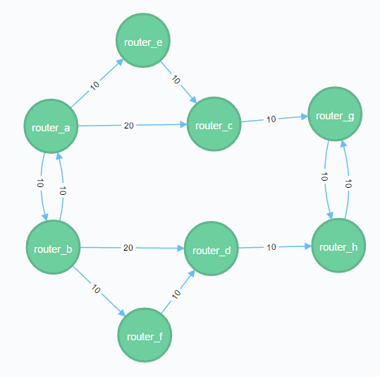
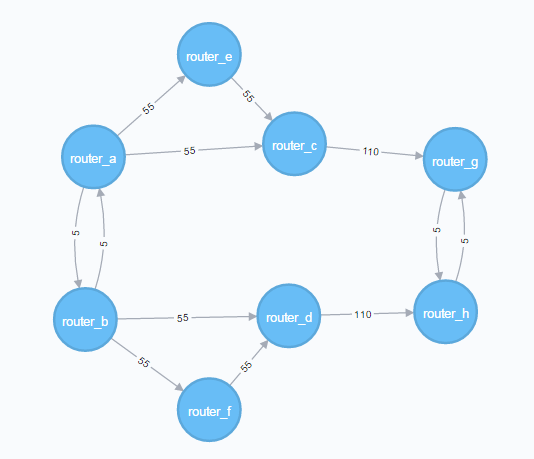

### Neo4j supports bulk import of network topology.

`Nodes.csv` - defines a list of nodes to be created
`topology.csv` - defines relationships between nodes

importing an example topology as a `root` user

* delete existing database - `rm -rf /var/lib/neo4j/data/graph.db/*`
* create new topology - `su neo4j -c "neo4j-import --into /var/lib/neo4j/data/graph.db/ --nodes Nodes.csv --relationships topology.csv"`
* restart database - `systemctl restart neo4j`

To update topology or metric modify `topology.csv` and follow the same steps again or use cypher queries to make changes.


running the following command on example topology shows available ECMP paths in the network.

```
# cat examples/demands.csv
Source,Destination,bps
router_a,router_g,100
router_a,router_h,10
router_b,router_h,100
router_b,router_g,10
```

```
# python place_demands.py --file examples/demands.csv
50.0 router_a router_e router_c router_g
50.0 router_a router_c router_g
2.5 router_a router_e router_c router_g router_h
2.5 router_a router_c router_g router_h
2.5 router_a router_b router_f router_d router_h
2.5 router_a router_b router_d router_h
50.0 router_b router_f router_d router_h
50.0 router_b router_d router_h
2.5 router_b router_f router_d router_h router_g
2.5 router_b router_d router_h router_g
2.5 router_b router_a router_e router_c router_g
2.5 router_b router_a router_c router_g
```

### Example topology



### Place MPLS LSPs demands

```
# python place_demands.py --file examples/demands.csv --simN 1
```

`--simN` is an optional parameter that require a number. 
It will summarize demands in one direction between two nodes.
Relationship label is `SimN` where `N` is a number.


